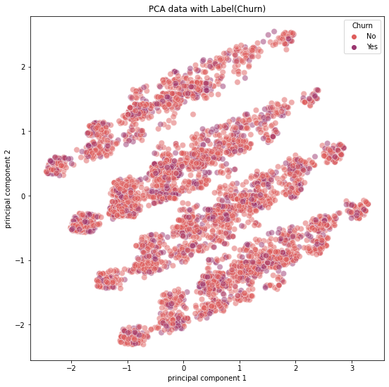
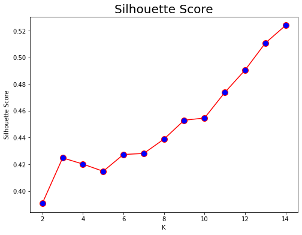
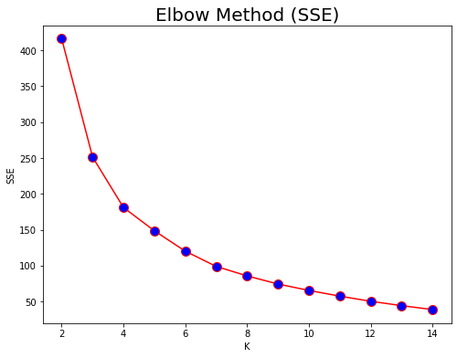
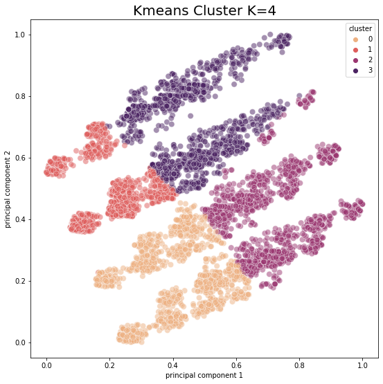
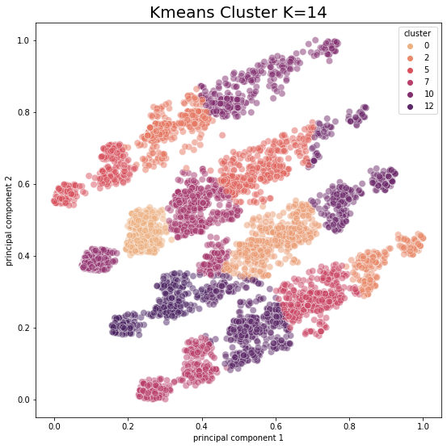
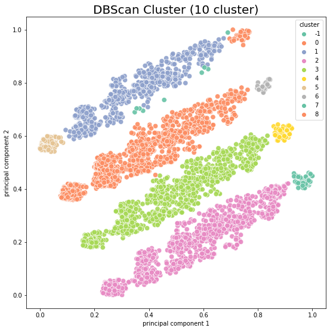

# CUSTOMER CLUSTERING
## Customer Clustering with K-Means vs DBSCAN

#

### **NOTE:** for full EDA and data explanation, please refer to 'customer_churn.ipynb' notebook or the churn prediction repository's README file [here](https://github.com/laurensiavee/customer-churn-prediction)

#

## About Clustering

Clustering is one of Machine Learing Implementation, which was unsupervised learning, where the algorithm will classify data based of it simmilar feature into several cluster. 

Why Customer Clustering?
By doing Customer Clustering, we can finds simmilar customer group and bring new business oppotunity to a certain customer group.

In this notebook, we will try to cluster Telco Customer data with K-Means and DBSCAN. We will reduce the feature dimensionality into 2 features with PCA for visualization.

#

### **Objective**
- Feature Dimensionality Reduction to 2D with PCA
- Cluster customer and visualize (with K-Means and DBSCAN)

#

***check full jupyter notebook [here](customer_clustering.ipynb)***

#

## PREPROCESSING
we did the same preprocessing and feature selection from [previous notebook](https://github.com/laurensiavee/customer-churn-prediction). So would not explain any preprocessing step I did here.

#

## PCA DIMENSIONALITY REDUCTION
we reduce the features to 2 features (2D) to visualize the data.

PCA data plot with Churn as label:

by observing the plot. we can se 4 main cluster are formed (that looks like 4 parallel straight line)

#

## K-MEANS CLUSTERING
K-Means Clustering is a well-known clustering algorithm. We will loop the algorithm with number of cluster (k) to find the best k by silhouette score and error (SSE).

we can't see clearly what k is the best, it show the minimum error and best silgouette score was the highest k (which is k=14) but it most unlikely the pca data was have that much cluster. 

By visualisation of pca data before, we can see 4 cluster form but K-Means seems didn't show this relationship. lets see the K-Means cluster with k=4 

Kmeans cluster with K=4 didn't cluster as what as we expected. It doesn't show any relation for each cluster too. Let's try k=14, which have the best silhouette score and minimum sse from our iteration.

the cluster seems have too many k and didn;t really shows relationship. Let's try with other algorithm.

#

## DBSCAN

DBSCAN parameter (I tried to find the best fit so far): 

    dbscan = DBSCAN(eps=0.03, min_samples=11)

we can see major 4 cluster formed by cluster 1 (blue), cluster 0 (orange), cluster 3 (light green), and cluster 5 (pink)

result with DBSCAN:

    est cluster: 10
    est noise  : 9
